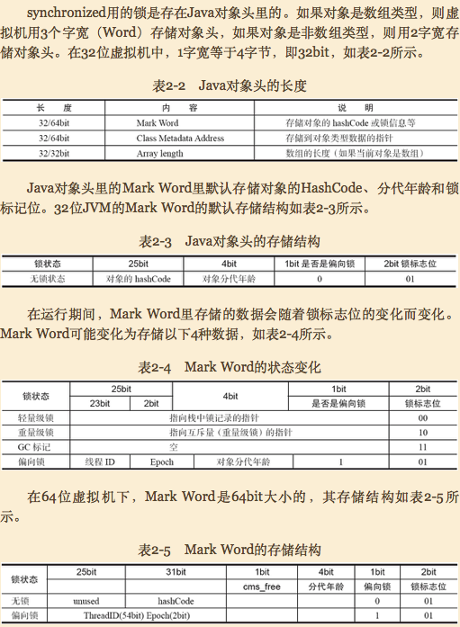

### volatile

volatile是轻量级的synchronized，在多处理器（多线程）开发中保证了共享变量的“可见性”。可见性表示当一个线程修改了一个共享变量时，另外一个线程能读到这个修改的值。正确的使用volatile，能比synchronized的使用和执行成本更低，因为它不会引起线程上下文的切换和调度。使用时只需要把字段声明成volatile即可。

 

处理器实现，有volatile变量修饰的共享变量进行写操作的时候会出现LOCK前缀指令。触发两件事情，1、将当前处理器缓存行的数据写回到系统内存。2、这个写会内存的操作会使在其他CPU里缓存了该内存地址的数据无效。

 

正常情况下，处理器不直接和内存进行通信，而是先将系统内存的数据读取到内部缓存（L1，L2或其他），但操作完不知道何时会写到内存。如果对声明了volatile的变量进行写操作，JVM就会向处理器发送一条LOCK前缀的指令，将这个变量所在的缓存行的数据写回到内存。但是，就算写回到内存，如果其他处理器缓存的值还是旧的，再执行计算操作就会有问题。所有，在多处理器下，为了保证各个处理器缓存是一致的，就会实现缓存一致性协议，每个处理器通过嗅探在总线上传播的数据来检查自己的缓存的值是不是过期了，当处理器发现自己缓存行对应的内存地址被修改，就会将当前处理器的缓存行设置为无效状态，当处理器对这个数据进行修改操作的时候，会重新从系统内存中把数据都到处理器缓存里。

volatile两个实现原则

1）在执行指令期间，声言处理器的LOCK＃信号。在多处理器环境中，LOCK＃信号确保在声言该信号期间，处理器可以独占任何共享内存。在老的处理器中，LOCK＃信号一般锁总线，但是锁总线的开销比较大，现在的处理器，一般锁缓存。

2）一个处理器的缓存回写到内存内会导致其他处理器的缓存无效。

volatile所能保证的是可见性，不能保证Java程序的原子性。

还是以最常用的i++来说吧，包含3个步骤

1，从内存读取i当前的值

2，加1

3，把修改后的值刷新到内存

对于普通变量来说多线程下1，2之间被中断，其它线程修改了i的值，那原来已经在1，2之间被中断的线程的i的值就已经无效了，所以多线程是不安全的。

另外对于普通变量来说，步骤1并不是每次都会从内存中读取，步骤3也并不会每次都保证会立即刷新到内存。

所以这里有两个问题，可见性和原子性，viloate只能保证可见性，即步骤1每次都重新读，步骤3每次都立即刷新到主内存。但1，2之间仍然会被中断，多个线程交叉修改，所以仍然不安全。

### Synchronized

synchronized，Java中每个对象都可以作为锁。3种形式：1、普通同步方法，锁就是当前实例对象。2、静态同步方法，锁是当前类的class对象。3、同步方法块，锁是Synchronized括号里配置的对象。

 

JVM基于进入和退出Monitor对象来实现方法同步和代码块同步，但是实现细节不同，代码块同步是实用monitorenter和monitorexit指令实现的，而方法同步是实用另外一种方式实现。monitorenter插入在代码块的开始位置，而monitorexit是插入在代码块结束和异常处，保证每个monitorenter必须有对应的monitorexit配对，任何一个对象都有monitor关联，当且一个monitor被持有后，就处于锁定状态。线程执行到monitorenter指令时，将会尝试获取对象所对应的monitor的所有权，即尝试获取对象的锁。

 

Java SE1.6为了减少获取锁和释放锁的性能消耗，引入了“偏向锁”和“轻量级锁”，总共四种状态：无锁状态、偏向锁状态、轻量级锁状态和重量级锁状态。

 

#### 偏向锁

主要针对只有一个线程访问同步块的场景（很多情况下不存在多线程竞争，总是由同一个锁多次获得），如果是这种情况直接在对象头和栈帧中的锁记录里存储锁偏向的线程ID，以后该线程在进入和退出同步块时不需要进行CAS操作来加锁和解锁。Word里是否存储着指向当前线程的偏向锁。如果测试成功，表示线程已经获得了锁。如果测试失败，则需要再测试一下Mark Word中偏向锁的标识是否设置成1（表示当前是偏向锁）：如果没有设置，则使用CAS竞争锁；如果设置了，则尝试使用CAS将对象头的偏向锁指向当前线程。

偏向锁的撤销，等到竞争出现才释放锁的机制，所以当其他线程尝试竞争偏向锁时，持有偏向锁的线程才会释放锁。

缺点是如果线程间存在锁竞争，会带来额外的锁撤销的消耗。

 

#### 轻量级锁

竞争的线程不会阻塞，提高程序的响应速度，但是如果始终得不到锁竞争的线程，使用自旋会消耗CPU，适用于追求响应时间，同步块执行速度非常快。

 

#### 重量级锁

线程竞争不适用自旋，不会消耗CPU，但是会线程阻塞，响应时间缓慢。适用于追求吞吐量，同步块执行速度较长。

 

