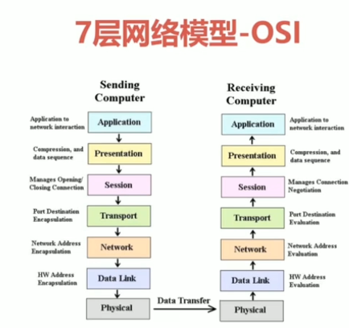
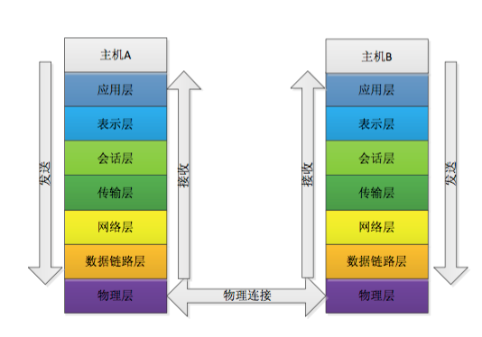
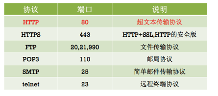

## 什么是网络编程

### 什么是网络

网络是信息传输,接收,共享的虚拟平台

通过各个点面体的信息联系到一起,从而实现这些资源的共享

- 应用层
  - OSI 的应用层协议包括文件的传输、访问及管理协议(FTAM) ,以及文件虚拟终端协议(VIP)和公用管理系统信息(CMIP)等;
    `规定数据的传输协议；`
- 表示层
  - 表示层􏰁供多种功能用于应用层数据编码和转化,以确保以一个系统应用层发送的信息 可以被另一个系统应用层识别;
    `可以理解为：解决不同系统之间的通信，eg：Linux下的QQ和Windows下的QQ可以通信；`
- 会话层
  - 会话层建立、管理和终止表示层与实体之间的通信会话；
    `建立一个连接（自动的手机信息、自动的网络寻址）;`
- 传输层
  - 传输层向高层􏰁提供可靠的端到端的网络数据流服务。
    `可以理解为：每一个应用程序都会在网卡注册一个端口号，该层就是端口与端口的通信！常用的（TCP／IP）协议；`
- 网络层
  - 网络层负责在源和终点之间建立连接;
    `可以理解为，此处需要确定计算机的位置，怎么确定？IPv4，IPv6！`
- 数据链路层
  - 数据链路层通过物理网络链路􏰁供数据传输。不同的数据链路层定义了不同的网络和协 议特征,其中包括物理编址、网络拓扑结构、错误校验、数据帧序列以及流控;
    `可以简单的理解为：规定了0和1的分包形式，确定了网络数据包的形式；`
- 物理层
  - 物理层负责最后将信息编码成电流脉冲或其它信号用于网上传输；
    `eg：RJ45等将数据转化成0和1；`

常见的应用层协议：

 

基础层

- 物理层
- 数据链路层
- 网络层

传输层

	- TCP-UDP协议
	- Socket

高级曾

- 会话层
- 表示层
- 应用层

# Socket与TCP,UDP

## 什么是Socket

简单来说就是IP地址与端口的结合协议(RFC 793)

一种地址与端口的结合描述协议

TCP/IP协议的相关API的总称;是网络Api的集合实现

涵盖了: Stream Socket/Datagram Socket

## Socket的作用与组成

- 在网络传输中用于唯一标识两个端点之间的链接
- 端点: 包括(IP+Port)
- 4个要素:
  - 客户端地址
  - 客户端端口
  - 服务器地址
  - 服务器端口

### TCP

- TCP是面向连接的通信协议
- 通过三次握手建立连接,通讯完成时要拆除连接
- TCP是面向连接的,只能用于端到端的通信

### UDP

- UDP是面向无连接的通讯协议
- UDP数据包括目的端口号和源端口号信息
- 由于通讯不需要连接,所以可以实现广播发送,并不限于端到端

## Client-Server Application

- TCP/IP协议中,两个进程间通信的主要模式为: CS模型
- 主要目的: 协同网络中的计算机资源,服务模式,进程间数据共享
- 常见的
  - FTP
  - SMTP
  - HTTP

## Socket TCP

- 构建TCP客户端,服务端
- 客户端发送数据
- 服务器读取数据并打印