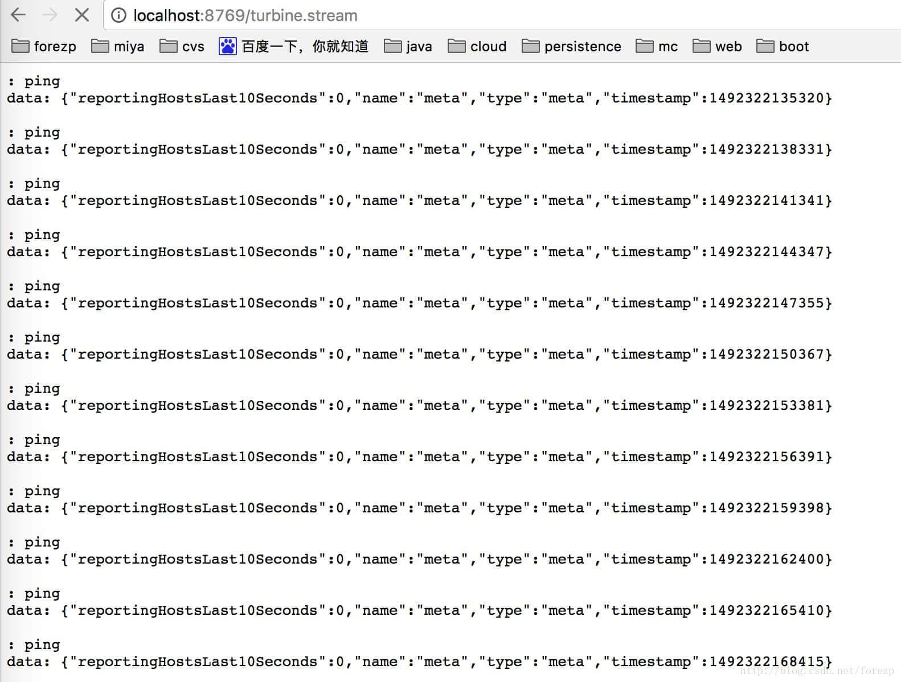
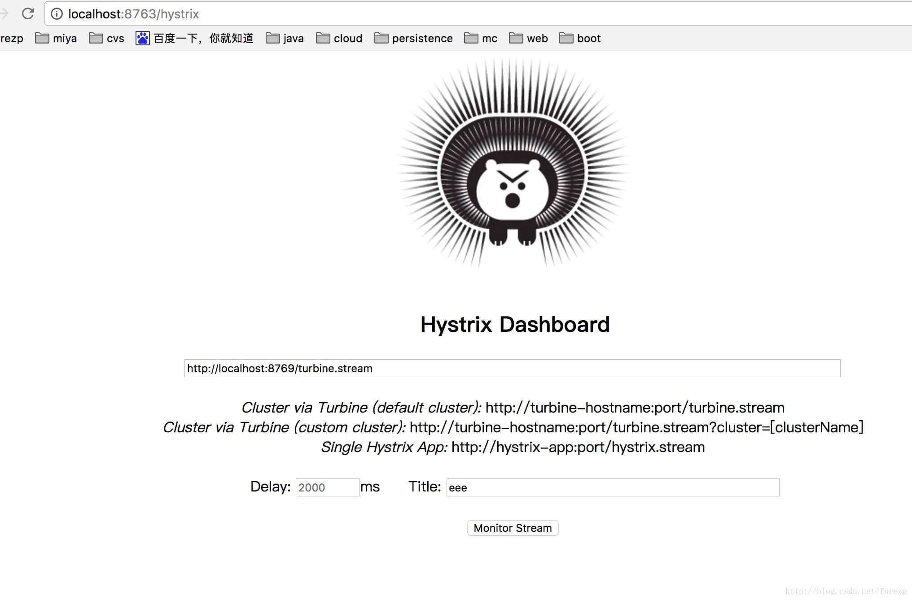
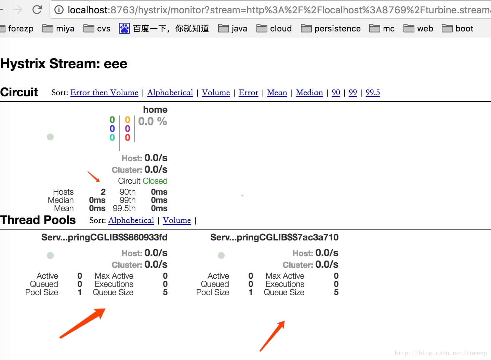

当我们有很多个服务的时候，这就需要聚合所以服务的Hystrix Dashboard的数据了。这就需要用到Spring Cloud的另一个组件了，即Hystrix Turbine。

## 一、Hystrix Turbine简介

看单个的Hystrix Dashboard的数据并没有什么多大的价值，要想看这个系统的Hystrix Dashboard数据就需要用到Hystrix Turbine。Hystrix Turbine将每个服务Hystrix Dashboard数据进行了整合。Hystrix Turbine的使用非常简单，只需要引入相应的依赖和加上注解和配置就可以了。

## 二、准备工作

本文使用的工程为上一篇文章的工程，在此基础上进行改造。因为我们需要多个服务的Dashboard，所以需要再建一个服务，取名为service-lucy，它的基本配置同service-hi，具体见[源码](https://github.com/forezp/SpringCloudLearning/tree/master/chapter13),在这里就不详细说明。

## 三、创建service-turbine

引入相应的依赖：

```
<dependencies>
		<dependency>
			<groupId>org.springframework.cloud</groupId>
			<artifactId>spring-cloud-starter-turbine</artifactId>
		</dependency>
		<dependency>
			<groupId>org.springframework.cloud</groupId>
			<artifactId>spring-cloud-netflix-turbine</artifactId>
		</dependency>
		<dependency>
			<groupId>org.springframework.boot</groupId>
			<artifactId>spring-boot-starter-actuator</artifactId>
		</dependency>

		<dependency>
			<groupId>org.springframework.boot</groupId>
			<artifactId>spring-boot-starter-test</artifactId>
			<scope>test</scope>
		</dependency>
	</dependencies>
```

在其入口类ServiceTurbineApplication加上注解@EnableTurbine，开启turbine，@EnableTurbine注解包含了@EnableDiscoveryClient注解，即开启了注册服务。

```
@SpringBootApplication
@EnableTurbine
public class ServiceTurbineApplication {

	public static void main(String[] args) {

			new SpringApplicationBuilder(ServiceTurbineApplication.class).web(true).run(args);
	}
}
```

配置文件application.yml：

```
spring:
  application.name: service-turbine
server:
  port: 8769
security.basic.enabled: false
turbine:
  aggregator:
    clusterConfig: default   # 指定聚合哪些集群，多个使用","分割，默认为default。可使用http://.../turbine.stream?cluster={clusterConfig之一}访问
  appConfig: service-hi,service-lucy  ### 配置Eureka中的serviceId列表，表明监控哪些服务
  clusterNameExpression: new String("default")
  # 1. clusterNameExpression指定集群名称，默认表达式appName；此时：turbine.aggregator.clusterConfig需要配置想要监控的应用名称
  # 2. 当clusterNameExpression: default时，turbine.aggregator.clusterConfig可以不写，因为默认就是default
  # 3. 当clusterNameExpression: metadata['cluster']时，假设想要监控的应用配置了eureka.instance.metadata-map.cluster: ABC，则需要配置，同时turbine.aggregator.clusterConfig: ABC
eureka:
  client:
    serviceUrl:
      defaultZone: http://localhost:8761/eureka/
      
     
```

配置文件注解写的很清楚。

## 四、Turbine演示

依次开启eureka-server、service-hi、service-lucy、service-turbine工程。

打开浏览器输入：http://localhost:8769/turbine.stream,界面如下：



依次请求：

> http://localhost:8762/hi?name=forezp
>
> http://localhost:8763/hi?name=forezp

打开:http://localhost:8763/hystrix,输入监控流http://localhost:8769/turbine.stream



点击monitor stream 进入页面：



可以看到这个页面聚合了2个service的hystrix dashbord数据。