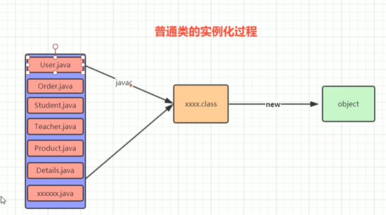
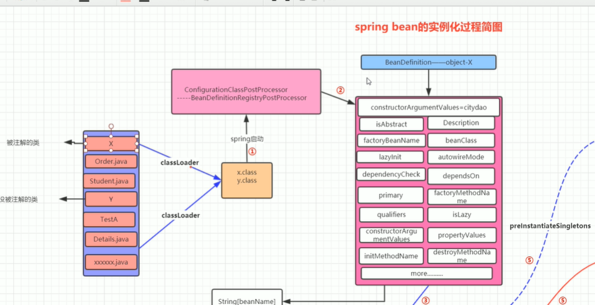
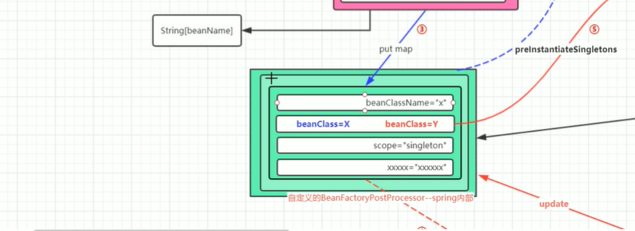
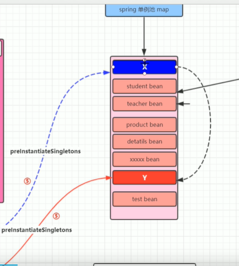
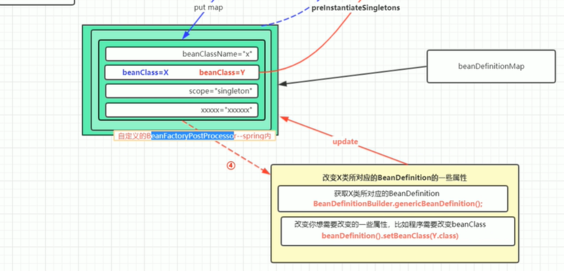

#### 普通java类和SpringBean的区别

SpringBean一定是一个Java对象

Java对象不一定是一个SpringBean












Spring扫描Map中存放的BeanDefinition时，如果发现这个类是单例的，立马实例化这个类，并放到spring单例池中


如果是原型则不实例化


```java
public static void main(String[] args) {
		//实例化Spring环境，容器

		/**
		 * 1. 扫描
		 * 2. 类的信息缓存到一个map中--BeanDefinition
		 * 3. 遍历这个map开始实例化
		 */

		AnnotationConfigApplicationContext ac = new AnnotationConfigApplicationContext(AppConfig.class);

		System.out.println(ac.getBean(X.class));
	}
```

