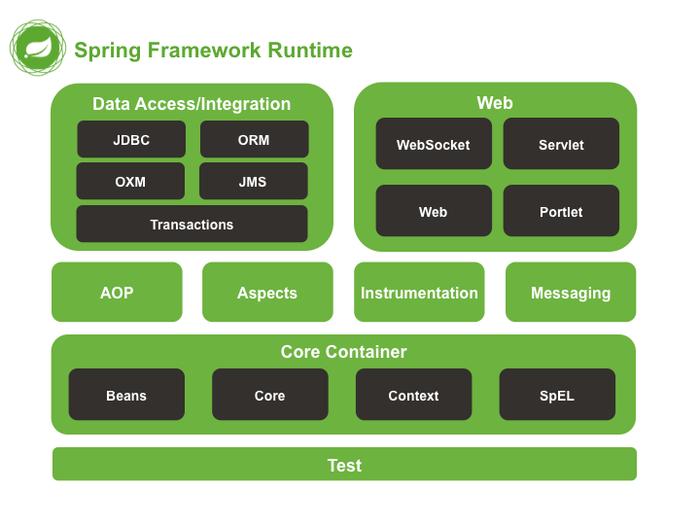
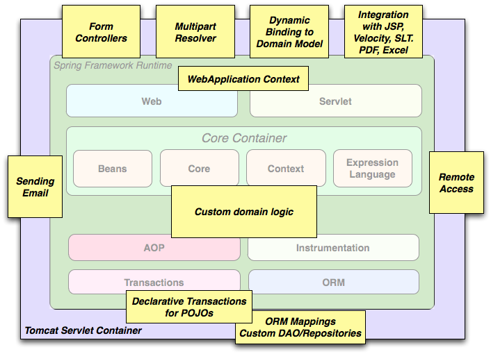
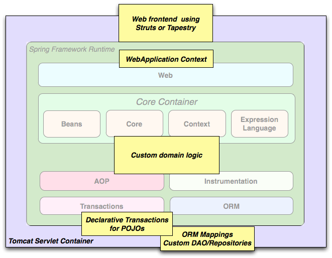
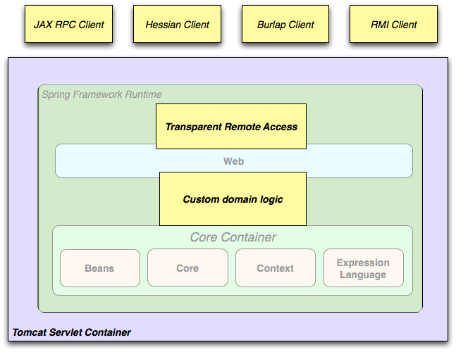
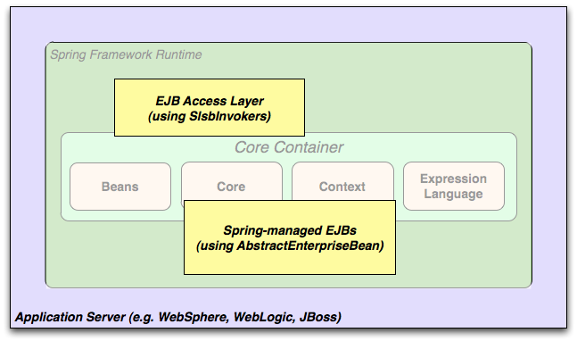

# 一、整体架构

Spring框架是一个分层架构，他包含一系列的功能要素，并被分为大约20个模块，如下图所示（很遗憾，并没有找到Spring5的架构图，下图是Spring4的，但结合Spring5的源码来看，该图还是能够体现Spring5的核心模块）

这些模块被总结为以下几部分。

## 1. 核心容器

Core Container（核心容器）包含有Core、Beans、Context和Expression Language模块。Core和Beans模块是框架的基础部分，提供IoC（控制反转）和DI（依赖注入）特性。这里的基础概念是BeanFactory，它提供对Factory模式的经典实现来消除对程序性单例模式的需要，并真正地允许你从程序逻辑中分离出依赖关系和配置。

- Core模块主要包含Spring框架基本的核心工具类，Spring的其他组件都要使用到这个包里的类，Core模块是其他组件的基本核心。当然你也可以在自己的应用系统中使用这些工具类。
- Beans模块是所有应用都要用到的，它包含访问配置文件、创建和管理Bean以及进行Inversion of Control/Dependency Injection（IoC/DI）操作相关的所有类。
- Context模块构建于Core和Beans模块基础之上，提供了一种类似于JNDI注册器的框架式的对象访问方法。Context模块继承了Beans的特性，为Spring核心提供了大量扩展，添加了对国际化（例如资源绑定）、事件传播、资源加载和对Context的透明创建的支持。Context同时也支持J2EE的一些特性，例如EJB、JMX和基础的远程处理。ApplicationContext接口是Context模块的关键。
- Expression Language 模块提供了一个强大的表达式语言用于在运行时查询和操纵对象。它是JSP2.1规范中定义的unifed expression language的一个扩展。该语言支持设置/获取属性的值，属性的分配，方法的调用，访问数组上下文（accession the context of arrays）,容器和索引器，逻辑和算数运算符，命名变量以及从Spring的IoC容器中根据名称检索对象。它也支持list投影，选择和一般的list聚合。

## 2. 数据访问/集成

Data Access/Integration（数据访问/集成）层包含有JDBC、ORM、OXM、JMS和Transaction模块，其中：

- JDBC模块提供了一个JDBC抽象层，它可以消除冗长的JDBC编码和解析数据库厂商特有的错误代码。这个模块包含了Spring对JDBC数据访问进行封装的所有类。
- ORM(Object Relational Mapping对象关系映射)模块为流行的对象-关系映射API，如JPA、JDO、Hibernate、iBatis等，提供了一个交互层。利用ORM封装包，可以混合使用所有Spring提供的特性进行O/R映射。如前边提到的简单声明性事务管理。

Spring框架插入了若干个ORM框架，从而提供了ORM的对象关系工具，其中包括JDO、Hibernate和iBatisSQL Map。所有这些都遵从Spring的通用事务和DAO异常层次结构。

- OXM模块提供了一个对Object/XML映射实现的抽象层，Object/XML映射实现包括JAXB、Castor、XMLBeans、JiBX和XStream。
- JMS（Java Messaging Service）模块主要包含了一些制造和消费消息的特性。
- Transaction模块支持编程和声明性的事务管理，这些事务类必须实现特定的接口，并且对所有的POJO都适用。

## 3. Web

Web上下文模块建立在应用程序上下文模块之上，为基于Web的应用程序提供了上下文。所以Spring框架支持与Jakarta Struts的集成。Web模块还简化了处理多部分请求以及将请求参数绑定到域对象的工作。Web层包含了Web、Web-Servlet、Web-Struts和Web-Porlet模块，具体说明如下。

- Web模块提供了基础的面向Web的集成特性。例如，多文件上传，使用servlet listeners初始化IoC容器以及一个面向Web的应用上下文。它还包含Spring远程支持中Web的相关部分。
- Web-Servlet模块（web.servlet.jar）包含Spring的model-view-controller（MVC）的实现。Spring的MVC框架使得模型范围内的代码和web forms之间能够清楚地分离开来，并与Spring框架的其他特性集成在一起。
- Web-Struts模块提供了对Struts的支持，使得类在Spring应用中能够与一个典型的Struts Web层集成在一起，注意，该支持在Spring3.0中是deprecated的。
- Web-Porlet模块提供了用于Portlet环境和Web-Servlet模块的MVC的实现。

## 4. AOP

AOP模块提供了一个符合AOP联盟标准的面向切面编程的实现，它让你可以定义例如方法拦截器和切点。从而将逻辑代码分开，降低它们之间的耦合性。利用source-level的元数据功能，还可以将各种行为信息合并到你的代码中，这有点像.Net技术中的attribute概念。

通过配置管理特性，SpringAOP模块直接将面向切面的编程功能集成到了Spring框架中，所以可以很容易地使Spring框架管理的任何对象支持AOP。Spring AOP模块为基于Spring的应用程序中的对象提供了事务管理服务。通过使用Spring AOP，不用依赖EJB组件，就可以将声明性事务管理集成到应用程序中。

- Aspects模块提供了对AspectJ（一个面向切面的框架，它扩展了Java语言）的集成支持。
- Instrumentation模块提供了class instrumentation 支持和classloader实现，使得可以在特定的应用服务器上使用。

## 5. Test

Test模块支持使用JUnit和TestNG对Spring组件进行测试。

# 二、设计理念

Spring是面向Bean的编程（BOP：Bean Oriented Programming），Bean在Spring中才是真正的主角。Bean在Spring中作用就像Object对OOP的意义一样，没有对象的概念就像没有面向对象编程，Spring中没有Bean也就没有Spring存在的意义。Spring提供了IoC 容器通过配置文件或者注解的方式来管理对象之间的依赖关系。

控制反转（Inversion of Control，缩写为IoC），是面向对象编程中的一种设计原则，可以用来减低计算机代码之间的耦合度。其中最常见的方式叫做依赖注入（Dependency Injection，简称DI），还有一种方式叫“依赖查找”（Dependency Lookup）。通过控制反转，对象在被创建的时候，由一个调控系统内所有对象的外界实体，将其所依赖的对象的引用传递给它。也可以说，依赖被注入到对象中。

# 三、使用场景

前面描述的模块使得Spring成为许多场景中的合理选择，从在资源受限设备上运行的嵌入式应用程序到使用Spring事务管理功能和Web框架集成的全面的企业应用程序。

## 1. **典型的Spring web应用程序**

Spring的声明式事务管理功能支持web应用程序全事务化，就同你使用EJB容器管理的事务一样。所有你的定制业务逻辑都可以由简单的POJOs实现，并由Spring IoC容器管理。其他服务包括发送email和独立于web层的校验，而你可以选择何处去执行校验规则。Spring的ORM支持同JPA和Hibernate的整合，比如，当你使用Hibernate时，可以保持原有的映射文件及标准Hibernate SessionFactory配置。表单控制器无缝整合了web层和域模型，无需那些转换HTTP参数到域模型的ActionForms或其他类。

## 2. Spring中间层使用第三方web框架

有时情况并不允许你完全切换到一个不同的框架。Spring框架不是一个要么使用全部特性要么什么都用不了的解决方案，不强制使用其中的每个功能。现存的前端如Struts，Tapestry，JSF或其他UI框架都可以同基于Spring的中间层整合在一起，从而使你能够使用Spring事务功能。你只需要使用ApplicationContext连接你的业务逻辑以及通过WebApplicationContext整合你的web层。

##  3. 远程调用

你可以使用Spring的Hessian-，Rmi-或HttpInvokerProxyFactoryBean类来通过web服务访问现存的代码。远程访问现存应用程序并不困难。

##  4. EJBs-包装现存POJOs

Spring框架还为企业JavaBeans提供了一个访问抽象层，使你能够重用现有的POJO，并将其包装在无状态会话bean中，以便在可能需要声名式安全的可扩展，故障安全的web应用程序中使用。