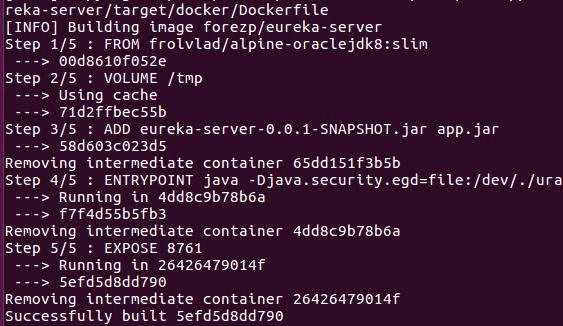
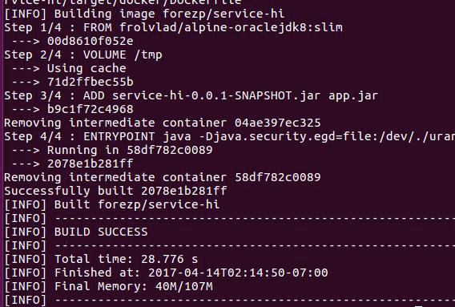
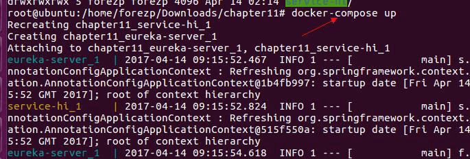

## 一、docker简介

Docker是一个开源的引擎，可以轻松的为任何应用创建一个轻量级的、可移植的、自给自足的容器。开发者在笔记本上编译测试通过的容器可以批量地在生产环境中部署，包括VMs（虚拟机）、bare metal、OpenStack 集群和其他的基础应用平台。

Docker通常用于如下场景：

- web应用的自动化打包和发布；
- 自动化测试和持续集成、发布；
- 在服务型环境中部署和调整数据库或其他的后台应用；
- 从头编译或者扩展现有的OpenShift或Cloud Foundry平台来搭建自己的PaaS环境。

Docker 的优点

- 1、简化程序： Docker 让开发者可以打包他们的应用以及依赖包到一个可移植的容器中，然后发布到任何流行的 Linux 机器上，便可以实现虚拟化。Docker改变了虚拟化的方式，使开发者可以直接将自己的成果放入Docker中进行管理。方便快捷已经是 Docker的最大优势，过去需要用数天乃至数周的 任务，在Docker容器的处理下，只需要数秒就能完成。
- 2、避免选择恐惧症： 如果你有选择恐惧症，还是资深患者。Docker 帮你 打包你的纠结！比如 Docker 镜像；Docker 镜像中包含了运行环境和配置，所以 Docker 可以简化部署多种应用实例工作。比如 Web 应用、后台应用、数据库应用、大数据应用比如 Hadoop 集群、消息队列等等都可以打包成一个镜像部署。
- 3、节省开支： 一方面，云计算时代到来，使开发者不必为了追求效果而配置高额的硬件，Docker 改变了高性能必然高价格的思维定势。Docker 与云的结合，让云空间得到更充分的利用。不仅解决了硬件管理的问题，也改变了虚拟化的方式。

上面文字参考了相关文章；另，关于docker 的安装和基本的使用见[相关教程](http://www.runoob.com/docker/docker-tutorial.html)。

## 二、准备工作

环境条件：

- linux系统，不建议windows
- docker最新版本
- jdk 1.8
- maven3.0

本文采用的工程来自第一篇文章的工程，采用maven的方式去构建项目，并采用docker-maven-plugin去构建docker镜像。

## 三、改造工程、构建镜像

### 改造eureka-server工程

在pom文件加上插件：

```
<build>
		<plugins>
			<plugin>
				<groupId>org.springframework.boot</groupId>
				<artifactId>spring-boot-maven-plugin</artifactId>
			</plugin>
			<!-- tag::plugin[] -->
			<plugin>
				<groupId>com.spotify</groupId>
				<artifactId>docker-maven-plugin</artifactId>
				<version>0.4.3</version>
				<configuration>
					<imageName>${docker.image.prefix}/${project.artifactId}</imageName>
					<dockerDirectory>src/main/docker</dockerDirectory>
					<resources>
						<resource>
							<targetPath>/</targetPath>
							<directory>${project.build.directory}</directory>
							<include>${project.build.finalName}.jar</include>
						</resource>
					</resources>
				</configuration>
			</plugin>
			<!-- end::plugin[] -->
		</plugins>
	</build>
```

Spotify 的 docker-maven-plugin 插件是用maven插件方式构建docker镜像的。

- imageName指定了镜像的名字，本例为 forep/eureka-server
- dockerDirectory指定 Dockerfile 的位置
- resources是指那些需要和 Dockerfile 放在一起，在构建镜像时使用的文件，一般应用 jar 包需要纳入。

修改下配置文件：

```
server:
  port: 8761
eureka:
  instance:
    prefer-ip-address: true
  client:
    registerWithEureka: false
    fetchRegistry: false
```

### 编写dockerfile文件：

```
FROM frolvlad/alpine-oraclejdk8:slim
VOLUME /tmp
ADD eureka-server-0.0.1-SNAPSHOT.jar app.jar
#RUN bash -c 'touch /app.jar'
ENTRYPOINT ["java","-Djava.security.egd=file:/dev/./urandom","-jar","/app.jar"]
EXPOSE 8761
```

### docker file编写指令：

- FROM

```
	FROM <image>
	FROM <image>:<tag>
	FROM <image> <digest>
```

FROM指令必须指定且需要在Dockerfile其他指令的前面，指定的基础image可以是官方远程仓库中的，也可以位于本地仓库。后续的指令都依赖于该指令指定的image。当在同一个Dockerfile中建立多个镜像时，可以使用多个FROM指令。

- VOLUME

格式为：

```
	 VOLUME ["/data"]
	 
```

使容器中的一个目录具有持久化存储数据的功能，该目录可以被容器本身使用，也可以共享给其他容器。当容器中的应用有持久化数据的需求时可以在Dockerfile中使用该指令。

- ADD

从src目录复制文件到容器的dest。其中src可以是Dockerfile所在目录的相对路径，也可以是一个URL，还可以是一个压缩包

- ENTRYPOINT

指定Docker容器启动时执行的命令，可以多次设置，但是只有最后一个有效。

- EXPOSE

为Docker容器设置对外的端口号。在启动时，可以使用-p选项或者-P选项。

### 构建镜像

执行构建docker镜像maven命令：

```
mvn clean
mvn package docker:build
```



构建eureka-server镜像成功。

### 同理构建service-hi镜像

- pom文件导入同eurek-server
- 修改下配置文件：

```
eureka:
  client:
    serviceUrl:
      defaultZone: http://eureka-server:8761/eureka/ # 这个需要改为eureka-server
server:
  port: 8763
spring:
  application:
    name: service-hi
```

在这里说下：defaultZone发现服务的host改为镜像名。

- dockefile 编写同eureka-server
- 构建镜像：

```
mvn clean
mvn package docker:build
```



这时我们运行docke的eureka-server 和service-hi镜像：

```
docker run -p 8761: 8761 -t forezp/eureka-server
docker run -p 8763: 8763 -t forezp/service-hi
```

访问localhost:8761


## 四、采用docker-compose启动镜像

Compose 是一个用于定义和运行多容器的Docker应用的工具。使用Compose，你可以在一个配置文件（yaml格式）中配置你应用的服务，然后使用一个命令，即可创建并启动配置中引用的所有服务。下面我们进入Compose的实战吧。

采用docker-compose的方式编排镜像，启动镜像：

```
version: '3'
services:
  eureka-server:
    image: forezp/eureka-server
    restart: always
    ports:
      - 8761:8761

  service-hi:
    image: forezp/service-hi
    restart: always
    ports:
      - 8763:8763
```

输入命令： docker-compose up



发现2个镜像按照指定的顺序启动了。

源码下载：<https://github.com/forezp/SpringCloudLearning/tree/master/chapter11>

## 五、采用docker-compose编排并启动镜像

docker-compose也可以构建镜像，现在我们采用docker-compose的方式构建镜像。

现在以eureka-server为例： 将Dockerfile移到eureka-server的主目录，改写ADD的相对路径：

```
FROM frolvlad/alpine-oraclejdk8:slim
VOLUME /tmp
ADD ./target/eureka-server-0.0.1-SNAPSHOT.jar app.jar
#RUN bash -c 'touch /app.jar'
ENTRYPOINT ["java","-Djava.security.egd=file:/dev/./urandom","-jar","/app.jar"]
EXPOSE 8761
```

同理修改service-hi目录；

编写构建镜像docker-compose-dev文件：

```
version: '3'
services:
  eureka-server:
    build: eureka-server
    ports:
      - 8761:8761

  service-hi:
    build: service-hi
    ports:
      - 8763:8763
```

命令构建镜像并启动：

```
docker-compose -f docker-compose.yml -f docker-compose-dev.yml up 
```

