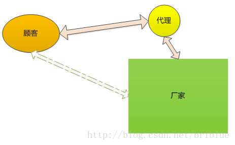
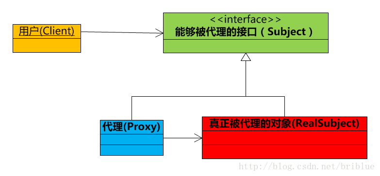
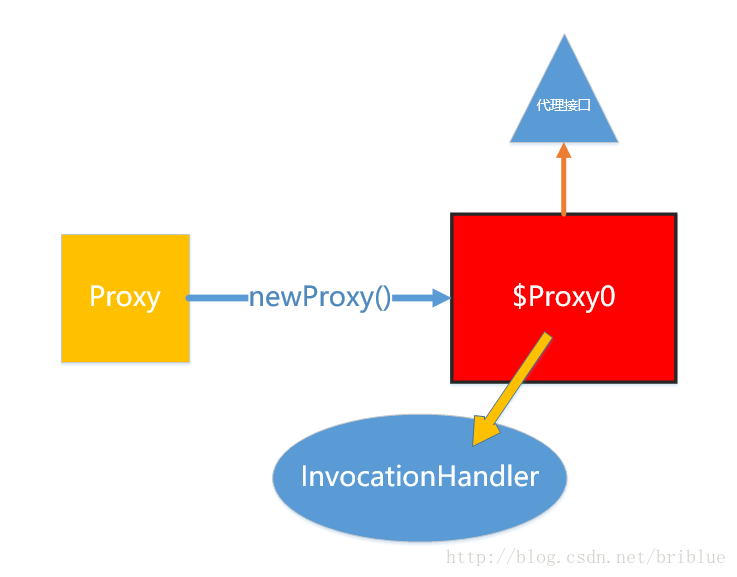

# 代理

代理是英文 Proxy 翻译过来的。我们在生活中见到过的代理，大概最常见的就是朋友圈中卖面膜的同学了。

她们从厂家拿货，然后在朋友圈中宣传，然后卖给熟人。



按理说，顾客可以直接从厂家购买产品，但是现实生活中，很少有这样的销售模式。一般都是厂家委托给代理商进行销售，顾客跟代理商打交道，而不直接与产品实际生产者进行关联。

所以，代理就有一种中间人的味道。

接下来，我们说说软件中的代理模式。

# 代理模式

代理模式是面向对象编程中比较常见的设计模式。


这是常见代理模式常见的 UML 示意图。

需要注意的有下面几点：
1. 用户只关心接口功能，而不在乎谁提供了功能。上图中接口是 Subject。
2. 接口真正实现者是上图的 RealSubject，但是它不与用户直接接触，而是通过代理。
3. 代理就是上图中的 Proxy，由于它实现了 Subject 接口，所以它能够直接与用户接触。
4. 用户调用 Proxy 的时候，Proxy 内部调用了 RealSubject。所以，Proxy 是中介者，它可以增强 RealSubject 操作。

如果难于理解的话，我用事例说明好了。值得注意的是，代理可以分为静态代理和动态代理两种。先从静态代理讲起。

# 静态代理

我们平常去电影院看电影的时候，在电影开始的阶段是不是经常会放广告呢？

电影是电影公司委托给影院进行播放的，但是影院可以在播放电影的时候，产生一些自己的经济收益，比如卖爆米花、可乐等，然后在影片开始结束时播放一些广告。

现在用代码来进行模拟。

首先得有一个接口，通用的接口是代理模式实现的基础。这个接口我们命名为 Movie，代表电影播放的能力。

```java
package com.frank.test;
 
 public interface Movie {
     void play();
 }
```

然后，我们要有一个真正的实现这个 Movie 接口的类，和一个只是实现接口的代理类。

```java
package com.frank.test;

public class RealMovie implements Movie {

    @Override
    public void play() {
        // TODO Auto-generated method stub
        System.out.println("您正在观看电影 《肖申克的救赎》");
    }

}
```

这个表示真正的影片。它实现了 Movie 接口，play() 方法调用时，影片就开始播放。那么 Proxy 代理呢？

```java
 package com.frank.test;
  
  public class Cinema implements Movie {
  
      RealMovie movie;
  
      public Cinema(RealMovie movie) {
          super();
          this.movie = movie;
     }
 
 
     @Override
     public void play() {
 
         guanggao(true);
 
         movie.play();
 
         guanggao(false);
     }
 
     public void guanggao(boolean isStart){
         if ( isStart ) {
             System.out.println("电影马上开始了，爆米花、可乐、口香糖9.8折，快来买啊！");
         } else {
             System.out.println("电影马上结束了，爆米花、可乐、口香糖9.8折，买回家吃吧！");
         }
     }
 
 }
```

Cinema 就是 Proxy 代理对象，它有一个 play() 方法。不过调用 play() 方法时，它进行了一些相关利益的处理，那就是广告。现在，我们编写测试代码。

```java
package com.frank.test;

public class ProxyTest {

    public static void main(String[] args) {

        RealMovie realmovie = new RealMovie();

        Movie movie = new Cinema(realmovie);

        movie.play();

    }

}
```

现在可以看到，**代理模式可以在不修改被代理对象的基础上，通过扩展代理类，进行一些功能的附加与增强。值得注意的是，代理类和被代理类应该共同实现一个接口，或者是共同继承某个类。**

上面介绍的是静态代理的内容，为什么叫做静态呢？因为它的类型是事先预定好的，比如上面代码中的 Cinema 这个类。下面要介绍的内容就是动态代理。

# 动态代理

既然是代理，那么它与静态代理的功能与目的是没有区别的，唯一有区别的就是动态与静态的差别。

那么在动态代理的中这个动态体现在什么地方？

上一节代码中 Cinema 类是代理，我们需要手动编写代码让 Cinema 实现 Movie 接口，而在动态代理中，我们可以让程序在运行的时候自动在内存中创建一个实现 Movie 接口的代理，而不需要去定义 Cinema 这个类。这就是它被称为动态的原因。

也许概念比较抽象。现在实例说明一下情况。

假设有一个大商场，商场有很多的柜台，有一个柜台卖茅台酒。我们进行代码的模拟。

```java
package com.frank.test;

public interface SellWine {

     void mainJiu();

}	
```

SellWine 是一个接口，你可以理解它为卖酒的许可证。

```java
package com.frank.test;

public class MaotaiJiu implements SellWine {

    @Override
    public void mainJiu() {
        // TODO Auto-generated method stub
        System.out.println("我卖得是茅台酒。");

    }

}
```

然后创建一个类 MaotaiJiu,对的，就是茅台酒的意思。

我们还需要一个柜台来卖酒：

```java
package com.frank.test;
import java.lang.reflect.InvocationHandler;
import java.lang.reflect.Method;


public class GuitaiA implements InvocationHandler {

    private Object pingpai;


    public GuitaiA(Object pingpai) {
        this.pingpai = pingpai;
    }


    @Override
    public Object invoke(Object proxy, Method method, Object[] args)
            throws Throwable {
        // TODO Auto-generated method stub
        System.out.println("销售开始  柜台是： "+this.getClass().getSimpleName());
        method.invoke(pingpai, args);
        System.out.println("销售结束");
        return null;
    }

}
```

GuitaiA 实现了 InvocationHandler 这个类

```java
package com.frank.test;
import java.lang.reflect.InvocationHandler;
import java.lang.reflect.Proxy;


public class Test {

    public static void main(String[] args) {
        // TODO Auto-generated method stub

        MaotaiJiu maotaijiu = new MaotaiJiu();


        InvocationHandler jingxiao1 = new GuitaiA(maotaijiu);


        SellWine dynamicProxy = (SellWine) Proxy.newProxyInstance(MaotaiJiu.class.getClassLoader(),
                MaotaiJiu.class.getInterfaces(), jingxiao1);

        dynamicProxy.mainJiu();

    }

}
```

## 动态代理语法

放轻松，下面我们开始讲解语法，语法非常简单。

动态代码涉及了一个非常重要的类 Proxy。正是通过 Proxy 的静态方法 newProxyInstance 才会动态创建代理。

### Proxy

```java
public static Object newProxyInstance(ClassLoader loader, Class<?>[] interfaces,InvocationHandler h)
```

下面讲解它的 3 个参数意义。

- loader 自然是类加载器
- interfaces 代码要用来代理的接口
- h 一个 InvocationHandler 对象

初学者应该对于 InvocationHandler 很陌生，我马上就讲到这一块。

### InvocationHandler

InvocationHandler 是一个接口，官方文档解释说，每个代理的实例都有一个与之关联的 InvocationHandler 实现类，如果代理的方法被调用，那么代理便会通知和转发给内部的 InvocationHandler 实现类，由它决定处理。

```java
public interface InvocationHandler {

    public Object invoke(Object proxy, Method method, Object[] args)
        throws Throwable;
}
```

InvocationHandler 内部只是一个 invoke() 方法，正是这个方法决定了怎么样处理代理传递过来的方法调用。

- proxy 代理对象
- method 代理对象调用的方法
- args 调用的方法中的参数

因为，Proxy 动态产生的代理会调用 InvocationHandler 实现类，所以 InvocationHandler 是实际执行者。

```java
public class GuitaiA implements InvocationHandler {

    private Object pingpai;


    public GuitaiA(Object pingpai) {
        this.pingpai = pingpai;
    }


    @Override
    public Object invoke(Object proxy, Method method, Object[] args)
            throws Throwable {
        // TODO Auto-generated method stub
        System.out.println("销售开始  柜台是： "+this.getClass().getSimpleName());
        method.invoke(pingpai, args);
        System.out.println("销售结束");
        return null;
    }

}
```

GuitaiA 就是实际上卖酒的地方。

现在，我们加大难度，我们不仅要卖**茅台酒**，还想卖**五粮液**。

```java
package com.frank.test;

public class Wuliangye implements SellWine {

    @Override
    public void mainJiu() {
        // TODO Auto-generated method stub
        System.out.println("我卖得是五粮液。");

    }

}
```

Wuliangye 这个类也实现了 SellWine 这个接口，说明它也拥有卖酒的许可证，同样把它放到 GuitaiA 上售卖。

```java
public class Test {

    public static void main(String[] args) {
        // TODO Auto-generated method stub

        MaotaiJiu maotaijiu = new MaotaiJiu();

        Wuliangye wu = new Wuliangye();

        InvocationHandler jingxiao1 = new GuitaiA(maotaijiu);
        InvocationHandler jingxiao2 = new GuitaiA(wu);

        SellWine dynamicProxy = (SellWine) Proxy.newProxyInstance(MaotaiJiu.class.getClassLoader(),
                MaotaiJiu.class.getInterfaces(), jingxiao1);
        SellWine dynamicProxy1 = (SellWine) Proxy.newProxyInstance(MaotaiJiu.class.getClassLoader(),
                MaotaiJiu.class.getInterfaces(), jingxiao2);

        dynamicProxy.mainJiu();

        dynamicProxy1.mainJiu();

    }

}
```

我现在扩大商场的经营，除了卖酒之外，还要卖烟。

首先，同样要创建一个接口，作为卖烟的许可证。


```java
package com.frank.test;

public interface SellCigarette {
    void sell();
}
```

```java
public class Furongwang implements SellCigarette {

    @Override
    public void sell() {
        // TODO Auto-generated method stub
        System.out.println("售卖的是正宗的芙蓉王，可以扫描条形码查证。");
    }

}
```

```java
package com.frank.test;
import java.lang.reflect.InvocationHandler;
import java.lang.reflect.Proxy;


public class Test {

    public static void main(String[] args) {
        // TODO Auto-generated method stub

        MaotaiJiu maotaijiu = new MaotaiJiu();

        Wuliangye wu = new Wuliangye();

        Furongwang fu = new Furongwang();

        InvocationHandler jingxiao1 = new GuitaiA(maotaijiu);
        InvocationHandler jingxiao2 = new GuitaiA(wu);

        InvocationHandler jingxiao3 = new GuitaiA(fu);

        SellWine dynamicProxy = (SellWine) Proxy.newProxyInstance(MaotaiJiu.class.getClassLoader(),
                MaotaiJiu.class.getInterfaces(), jingxiao1);
        SellWine dynamicProxy1 = (SellWine) Proxy.newProxyInstance(MaotaiJiu.class.getClassLoader(),
                MaotaiJiu.class.getInterfaces(), jingxiao2);

        dynamicProxy.mainJiu();

        dynamicProxy1.mainJiu();

        SellCigarette dynamicProxy3 = (SellCigarette) Proxy.newProxyInstance(Furongwang.class.getClassLoader(),
                Furongwang.class.getInterfaces(), jingxiao3);

        dynamicProxy3.sell();

    }

}
```

结果符合预期。大家仔细观察一下代码，同样是通过 Proxy.newProxyInstance() 方法，却产生了 SellWine 和 SellCigarette 两种接口的实现类代理，这就是动态代理的魔力。


## 动态代理的秘密

一定有同学对于为什么 Proxy 能够动态产生不同接口类型的代理感兴趣，我的猜测是肯定通过传入进去的接口然后通过反射动态生成了一个接口实例。
比如 SellWine 是一个接口，那么 Proxy.newProxyInstance() 内部肯定会有

```java
new SellWine();
```

这样相同作用的代码，不过它是通过反射机制创建的。那么事实是不是这样子呢？直接查看它们的源码好了。需要说明的是，我当前查看的源码是 1.8 版本。

```java
public static Object newProxyInstance(ClassLoader loader,
                                          Class<?>[] interfaces,
                                          InvocationHandler h)
        throws IllegalArgumentException
    {
        Objects.requireNonNull(h);

        final Class<?>[] intfs = interfaces.clone();


        /*
         * Look up or generate the designated proxy class.
         */
        Class<?> cl = getProxyClass0(loader, intfs);

        /*
         * Invoke its constructor with the designated invocation handler.
         */
        try {


            final Constructor<?> cons = cl.getConstructor(constructorParams);
            final InvocationHandler ih = h;
            if (!Modifier.isPublic(cl.getModifiers())) {
                AccessController.doPrivileged(new PrivilegedAction<Void>() {
                    public Void run() {
                        cons.setAccessible(true);
                        return null;
                    }
                });
            }

            return cons.newInstance(new Object[]{h});

        } catch (IllegalAccessException|InstantiationException e) {
            throw new InternalError(e.toString(), e);
        } catch (InvocationTargetException e) {
            Throwable t = e.getCause();
            if (t instanceof RuntimeException) {
                throw (RuntimeException) t;
            } else {
                throw new InternalError(t.toString(), t);
            }
        } catch (NoSuchMethodException e) {
            throw new InternalError(e.toString(), e);
        }
    }
```

newProxyInstance 的确创建了一个实例，它是通过 cl 这个 Class 文件的构造方法反射生成。cl 由 getProxyClass0() 方法获取。

```java
private static Class<?> getProxyClass0(ClassLoader loader,
                                       Class<?>... interfaces) {
    if (interfaces.length > 65535) {
        throw new IllegalArgumentException("interface limit exceeded");
    }

    // If the proxy class defined by the given loader implementing
    // the given interfaces exists, this will simply return the cached copy;
    // otherwise, it will create the proxy class via the ProxyClassFactory
    return proxyClassCache.get(loader, interfaces);
}
```

直接通过缓存获取，如果获取不到，注释说会通过 ProxyClassFactory 生成。

```java
/**
     * A factory function that generates, defines and returns the proxy class given
     * the ClassLoader and array of interfaces.
     */
    private static final class ProxyClassFactory
        implements BiFunction<ClassLoader, Class<?>[], Class<?>>
    {
        // Proxy class 的前缀是 “$Proxy”，
        private static final String proxyClassNamePrefix = "$Proxy";

        // next number to use for generation of unique proxy class names
        private static final AtomicLong nextUniqueNumber = new AtomicLong();

        @Override
        public Class<?> apply(ClassLoader loader, Class<?>[] interfaces) {

            Map<Class<?>, Boolean> interfaceSet = new IdentityHashMap<>(interfaces.length);
            for (Class<?> intf : interfaces) {
                /*
                 * Verify that the class loader resolves the name of this
                 * interface to the same Class object.
                 */
                Class<?> interfaceClass = null;
                try {
                    interfaceClass = Class.forName(intf.getName(), false, loader);
                } catch (ClassNotFoundException e) {
                }
                if (interfaceClass != intf) {
                    throw new IllegalArgumentException(
                        intf + " is not visible from class loader");
                }
                /*
                 * Verify that the Class object actually represents an
                 * interface.
                 */
                if (!interfaceClass.isInterface()) {
                    throw new IllegalArgumentException(
                        interfaceClass.getName() + " is not an interface");
                }
                /*
                 * Verify that this interface is not a duplicate.
                 */
                if (interfaceSet.put(interfaceClass, Boolean.TRUE) != null) {
                    throw new IllegalArgumentException(
                        "repeated interface: " + interfaceClass.getName());
                }
            }

            String proxyPkg = null;     // package to define proxy class in
            int accessFlags = Modifier.PUBLIC | Modifier.FINAL;

            /*
             * Record the package of a non-public proxy interface so that the
             * proxy class will be defined in the same package.  Verify that
             * all non-public proxy interfaces are in the same package.
             */
            for (Class<?> intf : interfaces) {
                int flags = intf.getModifiers();
                if (!Modifier.isPublic(flags)) {
                    accessFlags = Modifier.FINAL;
                    String name = intf.getName();
                    int n = name.lastIndexOf('.');
                    String pkg = ((n == -1) ? "" : name.substring(0, n + 1));
                    if (proxyPkg == null) {
                        proxyPkg = pkg;
                    } else if (!pkg.equals(proxyPkg)) {
                        throw new IllegalArgumentException(
                            "non-public interfaces from different packages");
                    }
                }
            }

            if (proxyPkg == null) {
                // if no non-public proxy interfaces, use com.sun.proxy package
                proxyPkg = ReflectUtil.PROXY_PACKAGE + ".";
            }

            /*
             * Choose a name for the proxy class to generate.
             */
            long num = nextUniqueNumber.getAndIncrement();
            String proxyName = proxyPkg + proxyClassNamePrefix + num;

            /*
             * Generate the specified proxy class.
             */
            byte[] proxyClassFile = ProxyGenerator.generateProxyClass(
                proxyName, interfaces, accessFlags);
            try {
                return defineClass0(loader, proxyName,
                                    proxyClassFile, 0, proxyClassFile.length);
            } catch (ClassFormatError e) {
                /*
                 * A ClassFormatError here means that (barring bugs in the
                 * proxy class generation code) there was some other
                 * invalid aspect of the arguments supplied to the proxy
                 * class creation (such as virtual machine limitations
                 * exceeded).
                 */
                throw new IllegalArgumentException(e.toString());
            }
        }
    }
```

这个类的注释说，通过指定的 ClassLoader 和 接口数组 用工厂方法生成 proxy class。 然后这个 proxy class 的名字是：

```java
// Proxy class 的前缀是 “$Proxy”，
private static final String proxyClassNamePrefix = "$Proxy";

long num = nextUniqueNumber.getAndIncrement();

String proxyName = proxyPkg + proxyClassNamePrefix + num;
```

所以，动态生成的代理类名称是**包名+$Proxy+id序号**。

生成的过程，核心代码如下：

```java
byte[] proxyClassFile = ProxyGenerator.generateProxyClass(
                proxyName, interfaces, accessFlags);


return defineClass0(loader, proxyName,
                    proxyClassFile, 0, proxyClassFile.length);
```

这两个方法，我没有继续追踪下去，defineClass0() 甚至是一个 native 方法。我们只要知道，动态创建代理这回事就好了。

现在我们还需要做一些验证，我要检测一下动态生成的代理类的名字是不是**包名+$Proxy+id序号**。

```java
public class Test {

    public static void main(String[] args) {
        // TODO Auto-generated method stub

        MaotaiJiu maotaijiu = new MaotaiJiu();

        Wuliangye wu = new Wuliangye();

        Furongwang fu = new Furongwang();

        InvocationHandler jingxiao1 = new GuitaiA(maotaijiu);
        InvocationHandler jingxiao2 = new GuitaiA(wu);

        InvocationHandler jingxiao3 = new GuitaiA(fu);

        SellWine dynamicProxy = (SellWine) Proxy.newProxyInstance(MaotaiJiu.class.getClassLoader(),
                MaotaiJiu.class.getInterfaces(), jingxiao1);
        SellWine dynamicProxy1 = (SellWine) Proxy.newProxyInstance(MaotaiJiu.class.getClassLoader(),
                MaotaiJiu.class.getInterfaces(), jingxiao2);

        dynamicProxy.mainJiu();

        dynamicProxy1.mainJiu();

        SellCigarette dynamicProxy3 = (SellCigarette) Proxy.newProxyInstance(Furongwang.class.getClassLoader(),
                Furongwang.class.getInterfaces(), jingxiao3);

        dynamicProxy3.sell();

        System.out.println("dynamicProxy class name:"+dynamicProxy.getClass().getName());
        System.out.println("dynamicProxy1 class name:"+dynamicProxy1.getClass().getName());
        System.out.println("dynamicProxy3 class name:"+dynamicProxy3.getClass().getName());

    }

}
```

SellWine 接口的代理类名是：`com.sun.proxy.$Proxy0`
SellCigarette 接口的代理类名是：`com.sun.proxy.$Proxy1`

这说明动态生成的 proxy class 与 Proxy 这个类同一个包。

下面用一张图让大家记住动态代理涉及到的角色。

红框中 `$Proxy0` 就是通过 Proxy 动态生成的。
`$Proxy0` 实现了要代理的接口。
`$Proxy0` 通过调用 `InvocationHandler` 来执行任务。

# 代理的作用

可能有同学会问，已经学习了代理的知识，但是，它们有什么用呢？

主要作用，还是在不修改被代理对象的源码上，进行功能的增强。

这在 AOP 面向切面编程领域经常见。

> 在软件业，AOP为Aspect Oriented Programming的缩写，意为：面向切面编程，通过预编译方式和运行期动态代理实现程序功能的统一维护的一种技术。AOP是OOP的延续，是软件开发中的一个热点，也是Spring框架中的一个重要内容，是函数式编程的一种衍生范型。利用AOP可以对业务逻辑的各个部分进行隔离，从而使得业务逻辑各部分之间的耦合度降低，提高程序的可重用性，同时提高了开发的效率。
>
> 主要功能
> 日志记录，性能统计，安全控制，事务处理，异常处理等等。

上面的引用是百度百科对于 AOP 的解释，至于，如何通过代理来进行日志记录功能、性能统计等等，这个大家可以参考 AOP 的相关源码，然后仔细琢磨。

同注解一样，很多同学可能会有疑惑，我什么时候用代理呢？

这取决于你自己想干什么。你已经学会了语法了，其他的看业务需求。对于实现日志记录功能的框架来说，正合适。

至此，静态代理和动态代理者讲完了。


# 总结

1. 代理分为静态代理和动态代理两种。
2. 静态代理，代理类需要自己编写代码写成。
3. 动态代理，代理类通过 Proxy.newInstance() 方法生成。
4. 不管是静态代理还是动态代理，代理与被代理者都要实现两样接口，它们的实质是面向接口编程。
5. 静态代理和动态代理的区别是在于要不要开发者自己定义 Proxy 类。
6. 动态代理通过 Proxy 动态生成 proxy class，但是它也指定了一个 InvocationHandler 的实现类。
7. 代理模式本质上的目的是为了增强现有代码的功能。