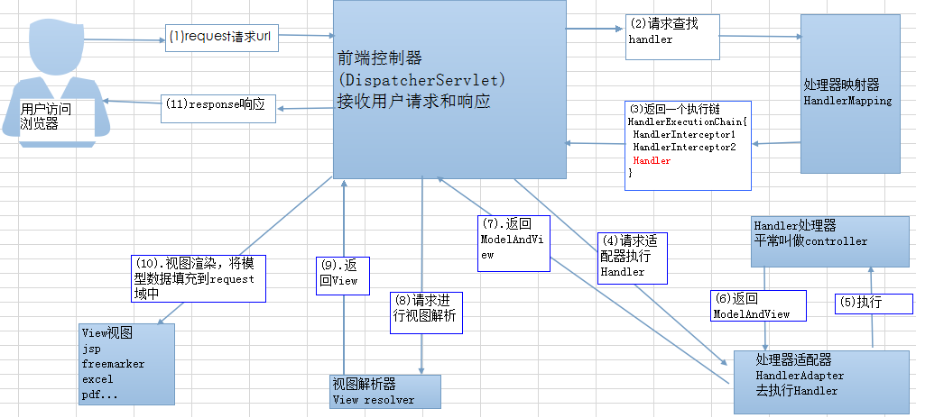
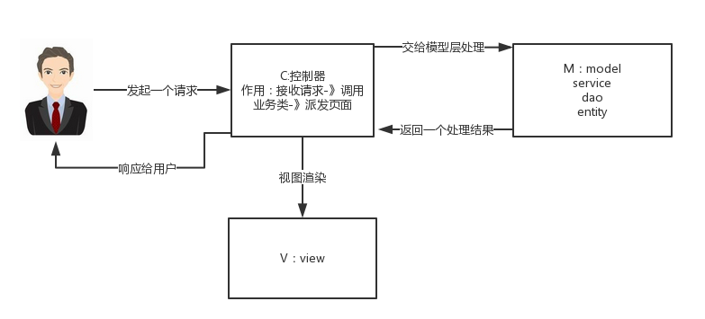
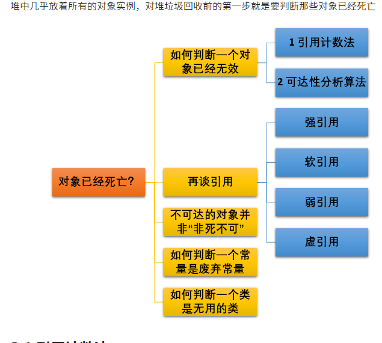

## 计算机中原码反码补码

使用补码，可以将符号位和其它位统一处理；同时，减法也可按加法来处理。另外，两个用补 
码表示的数相加时，如果最高位（符号位）有进位，则进位被舍弃。 

## springMVC架构的实现模式

1. 客户端（浏览器）发送请求，直接请求到 `DispatcherServlet`。
2. `DispatcherServlet` 根据请求信息调用 `HandlerMapping`，解析请求对应的 `Handler`。
3. 解析到对应的 `Handler`（也就是我们平常说的 `Controller` 控制器）后，开始由 `HandlerAdapter` 适配器处理。
4. `HandlerAdapter` 会根据 `Handler`来调用真正的处理器开处理请求，并处理相应的业务逻辑。
5. 处理器处理完业务后，会返回一个 `ModelAndView` 对象，`Model` 是返回的数据对象，`View` 是个逻辑上的 `View`。
6. `ViewResolver` 会根据逻辑 `View` 查找实际的 `View`。
7. `DispaterServlet` 把返回的 `Model` 传给 `View`（视图渲染）。
8. 把 `View` 返回给请求者（浏览器）

## Spring的特点

默认单例模式

@Scope(“prototype”)多例模式

## 微服务治理，服务注册和发现（Dubbo，和Http层)

dubbo传输层

http应用层

服务注册中型

## linux查看Java进程号

jps

ps -ef | grep 

## Java中的泛型（用反射可以强行跳过泛型）

泛型的本质是参数化类型，也就是说所操作的数据类型被指定为一个参数。这种参数类型可以用在类、接口和方法的创建中，分别称为泛型类、泛型接口、泛型方法。

**1，类型安全**

 泛型的主要目标是提高 Java 程序的类型安全。通过知道使用泛型定义的变量的类型限制，编译器可以在一个高得多的程度上验证类型假设。

**2，消除强制类型转换。**

泛型的一个附带好处是，消除源代码中的许多强制类型转换。这使得代码更加可读，并且减少了出错机会。

**3，潜在的性能收益。**

 泛型为较大的优化带来可能。在泛型的初始实现中，编译器将强制类型转换（没有泛型的话，程序员会指定这些强制类型转换）插入生成的字节码中。

## HashMap中出现哈希冲突

**HashMap 通过 key 的 hashCode 经过扰动函数处理过后得到 hash 值，然后通过 `(n - 1) & hash` 判断当前元素存放的位置（这里的 n 指的是数组的长度），如果当前位置存在元素的话，就判断该元素与要存入的元素的 hash 值以及 key 是否相同，如果相同的话，直接覆盖，不相同就通过拉链法解决冲突**

所谓 **“拉链法”** 就是：将链表和数组相结合。也就是说创建一个链表数组，数组中每一格就是一个链表。若遇到哈希冲突，则将冲突的值加到链表中即可。

## ArrayList和LinkedList

- **1. 是否保证线程安全：** `ArrayList` 和 `LinkedList` 都是不同步的，也就是不保证线程安全；
- **2. 底层数据结构：** `Arraylist` 底层使用的是 **`Object` 数组**；`LinkedList` 底层使用的是 **双向链表** 数据结构（JDK1.6之前为循环链表，JDK1.7取消了循环。注意双向链表和双向循环链表的区别，下面有介绍到！）
- **3. 插入和删除是否受元素位置的影响：** ① **`ArrayList` 采用数组存储，所以插入和删除元素的时间复杂度受元素位置的影响。** 比如：执行`add(E e)`方法的时候， `ArrayList` 会默认在将指定的元素追加到此列表的末尾，这种情况时间复杂度就是O(1)。但是如果要在指定位置 i 插入和删除元素的话（`add(int index, E element)`）时间复杂度就为 O(n-i)。因为在进行上述操作的时候集合中第 i 和第 i 个元素之后的(n-i)个元素都要执行向后位/向前移一位的操作。 ② **`LinkedList` 采用链表存储，所以对于`add(E e)`方法的插入，删除元素时间复杂度不受元素位置的影响，近似 O（1），如果是要在指定位置`i`插入和删除元素的话（`(add(int index, E element)`） 时间复杂度应为`o(n))`因为需要新创立一个新的链表，复制前i-1个元素并在第i位加入新的元素，最后附上n-i个元素。**
- **4. 是否支持快速随机访问：** `LinkedList` 不支持高效的随机元素访问，而 `ArrayList` 支持。快速随机访问就是通过元素的序号快速获取元素对象(对应于`get(int index)`方法)。
- **5. 内存空间占用：** ArrayList的空 间浪费主要体现在在list列表的结尾会预留一定的容量空间，而LinkedList的空间花费则体现在它的每一个元素都需要消耗比ArrayList更多的空间（因为要存放直接后继和直接前驱以及数据）。

## HashMap和ConcurrentHashMap的锁级别

从ConcurrentHashMap代码中可以看出，它引入了一个“分段锁”的概念，具体可以理解为把一个大的Map拆分成N个小的HashTable，根据key.hashCode()来决定把key放到哪个HashTable中。

  在ConcurrentHashMap中，就是把Map分成了N个Segment，put和get的时候，都是现根据key.hashCode()算出放到哪个Segment中

一个 ConcurrentHashMap 里包含一个 Segment 数组。Segment 的结构和HashMap类似，是一种数组和链表结构，一个 Segment 包含一个 HashEntry 数组，每个 HashEntry 是一个链表结构的元素，每个 Segment 守护着一个HashEntry数组里的元素，当对 HashEntry 数组的数据进行修改时，必须首先获得对应的 Segment的锁。

JDK1.8 ConcurrentHashMap取消了Segment分段锁，采用CAS和synchronized来保证并发安全。

synchronized只锁定当前链表或红黑二叉树的首节点，这样只要hash不冲突，就不会产生并发，效率又提升N倍。

## Volition锁的原理(可见性)

- **volatile关键字**是线程同步的**轻量级实现**，所以**volatile性能肯定比synchronized关键字要好**。但是**volatile关键字只能用于变量而synchronized关键字可以修饰方法以及代码块**。synchronized关键字在JavaSE1.6之后进行了主要包括为了减少获得锁和释放锁带来的性能消耗而引入的偏向锁和轻量级锁以及其它各种优化之后执行效率有了显著提升，**实际开发中使用 synchronized 关键字的场景还是更多一些**。
- **多线程访问volatile关键字不会发生阻塞，而synchronized关键字可能会发生阻塞**
- **volatile关键字能保证数据的可见性，但不能保证数据的原子性。synchronized关键字两者都能保证。**
- **volatile关键字主要用于解决变量在多个线程之间的可见性，而 synchronized关键字解决的是多个线程之间访问资源的同步性。**

## JVM内存区域

## JVM内存区域中的线程共享和线程私有区

## JVM垃圾回收机制

标记整理

标记清除

复制

分代收集

## JVM垃圾回收器的了解（G1回收)

### Serial 

### ParNew 

### Parallel Scavenge

### Serial Old

### Parallel Old 

### CMS

**获取最短回收停顿时间为目标的收集器**

### G1 

**主要针对配备多颗处理器及大容量内存的机器. 以极高概率满足 GC 停顿时间要求的同时,还具备高吞吐量性能特征.**

- **初始标记**
- **并发标记**
- **最终标记**
- **筛选回收**

## Spring的优点

## Spring中的两大特点 AOP和IOC

## Spring中Bean的生命周期

- Bean 容器找到配置文件中 Spring Bean 的定义。
- Bean 容器利用 Java Reflection API 创建一个Bean的实例。
- 如果涉及到一些属性值 利用 `set()`方法设置一些属性值。
- 如果 Bean 实现了 `BeanNameAware` 接口，调用 `setBeanName()`方法，传入Bean的名字。
- 如果 Bean 实现了 `BeanClassLoaderAware` 接口，调用 `setBeanClassLoader()`方法，传入 `ClassLoader`对象的实例。
- 如果Bean实现了 `BeanFactoryAware` 接口，调用 `setBeanClassLoader()`方法，传入 `ClassLoade` r对象的实例。
- 与上面的类似，如果实现了其他 `*.Aware`接口，就调用相应的方法。
- 如果有和加载这个 Bean 的 Spring 容器相关的 `BeanPostProcessor` 对象，执行`postProcessBeforeInitialization()` 方法
- 如果Bean实现了`InitializingBean`接口，执行`afterPropertiesSet()`方法。
- 如果 Bean 在配置文件中的定义包含 init-method 属性，执行指定的方法。
- 如果有和加载这个 Bean的 Spring 容器相关的 `BeanPostProcessor` 对象，执行`postProcessAfterInitialization()` 方法
- 当要销毁 Bean 的时候，如果 Bean 实现了 `DisposableBean` 接口，执行 `destroy()` 方法。
- 当要销毁 Bean 的时候，如果 Bean 在配置文件中的定义包含 destroy-method 属性，执行指定的方法。

## 如何判断对象是否要被回收

## RocketMQ的模式

### RocketMQ的消费模式

集群消费

广播消费

### RocketMQ如何保证消息100%被投递

1. 当你系统需要保证百分百消息不丢失，你可以使用生产者每发送一个消息，Broker 同步返回一个消息发送成功的反馈消息
2. 即每发送一个消息，同步落盘后才返回生产者消息发送成功，这样只要生产者得到了消息发送生成的返回，事后除了硬盘损坏，都可以保证不会消息丢失

## Redis的数据类型

## 常见的集合

#### List

- **Arraylist：** Object数组
- **Vector：** Object数组
- **LinkedList：** 双向链表(JDK1.6之前为循环链表，JDK1.7取消了循环)

#### 2. Set

- **HashSet（无序，唯一）:** 基于 HashMap 实现的，底层采用 HashMap 来保存元素
- **LinkedHashSet：** LinkedHashSet 继承于 HashSet，并且其内部是通过 LinkedHashMap 来实现的。有点类似于我们之前说的LinkedHashMap 其内部是基于 HashMap 实现一样，不过还是有一点点区别的
- **TreeSet（有序，唯一）：** 红黑树(自平衡的排序二叉树)

### Map

- **HashMap：** JDK1.8之前HashMap由数组+链表组成的，数组是HashMap的主体，链表则是主要为了解决哈希冲突而存在的（“拉链法”解决冲突）。JDK1.8以后在解决哈希冲突时有了较大的变化，当链表长度大于阈值（默认为8）时，将链表转化为红黑树，以减少搜索时间
- **LinkedHashMap：** LinkedHashMap 继承自 HashMap，所以它的底层仍然是基于拉链式散列结构即由数组和链表或红黑树组成。另外，LinkedHashMap 在上面结构的基础上，增加了一条双向链表，使得上面的结构可以保持键值对的插入顺序。同时通过对链表进行相应的操作，实现了访问顺序相关逻辑。
- **Hashtable：** 数组+链表组成的，数组是 HashMap 的主体，链表则是主要为了解决哈希冲突而存在的
- **TreeMap：** 红黑树（自平衡的排序二叉树）

## 重写equals为什么最好重写hashcode

如果两个对象根据equals方法比较是相等的，那么调用这两个对象的任意一个hashcode方法都必须产生相同的结果。

## Mysql默认的引擎(innodb)

## Mysql innodb引擎索引(使用的数据结构)

## Mysql的事务隔离界别

**READ-UNCOMMITTED(读取未提交)**

**READ-COMMITTED(读取已提交)**

**REPEATABLE-READ(可重复读)**

**SERIALIZABLE(可串行化)**

### B+树的特点

用最短的时间搜索到相关的内容

## Redis常见的数据结构

string list set hash sortedSet

## Redis是单线程的

